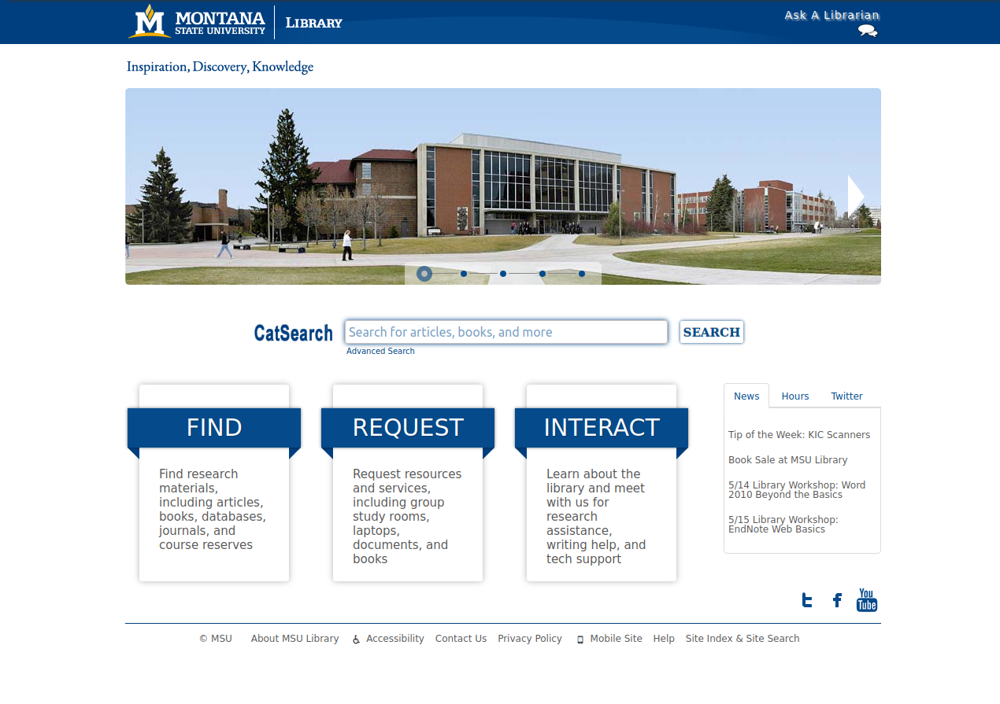
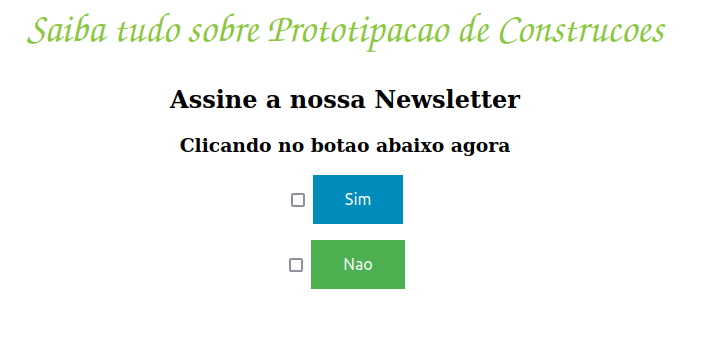
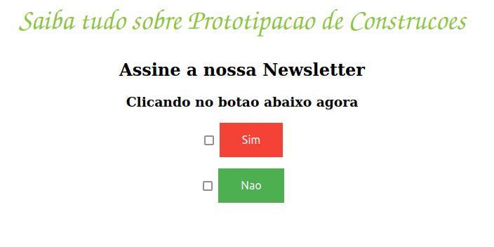

# Teste de Hipóteses
O teste A/B é um dos métodos mais utilizados para validar hipóteses de negócio sobre qual página web tem maior conversão, qual o melhor cupom de desconto, melhor preço promocional etc. Os cases abaixo apresentam o planejamento, execução e análise de teste A/B usando técnicas tradicionais de Estatística, e técnicas modernas de Multi-Armed Bandit (MAB).

# Teste A/B - Conversion Rate
A Electronic House é um comercio online ( e-commerce ) de produtos de informática
para casas e escritórios. Os clientes podem comprar mouses, monitores, teclados,
computadores, laptops, cabos HDMI, fones de ouvido, cameras webcam, entre
outros, através de um site online e recebem os produtos no conforto de suas casas.

Os produtos não são vendidos somente no Brasil, a Eletronic House está presente
em diversos países da Europa e da América do Norte.

O Diretor de Produtos Global pediu ao Head de Design que desenvolvesse uma
nova forma de finalizar a compra com cartão de crédito, sem a necessidade do
cliente preencher manualmente todas as informações do cartão e que funcionasse
em todos os países.

Depois de meses desenvolvendo esse dispositivo, o time de Desenvolvimento
Backend entregou uma solução de pagamentos, na qual 90% das informações do
formulário eram preenchido automaticamente.

O Head de Designer gostaria de medir a efetividade do novo dispositivo de
preenchimento automático dos dados do cartão de crédito na página de vendas e
reportar os resultados ao Diretor de Produtos Global, para concluir se a nova forma
de pagamento é realmente melhor do que a antiga.

As duas páginas foram colocadas no ar e durante alguns meses e o time de Front-
End desenvolveu uma automação que atribui um rótulo para cada cliente,
mostrando qual a página de vendas aquele determinado cliente estava visualizando.
Todos esses dados foram armazenados em um banco de dados e podem ser
acessados pelos times da Electronic House.

## Desafio
Depois de alguns meses de experimento, o time de Designers da Electronic House,
precisa avaliar os resultados do experimento realizado, a fim de concluir qual era a
forma de pagamento mais eficaz.

Porém, o time não possui as habilidades necessárias para avaliar os dados e
concluir o experimento. Nesse contexto, você foi contratado como Cientista de
Dados para ajudar o time de Designers a validar a efetividade do novo meio de
pagamento, com mais confiança e rigidez na análise.

Qual a melhor forma de pagamento: Preenchimento Manual ou Automático do
formulário de dados do cartão de crédito?

[Notebook com solução](teste_ab_gmv.ipynb)

# Teste A/B - GMV (Gross Margin Revenue)
A Electronic House é um comercio online ( e-commerce ) de produtos de informática
para casas e escritórios. Os clientes podem comprar mouses, monitores, teclados,
computadores, laptops, cabos HDMI, fones de ouvido, cameras webcam, entre
outros, através de um site online e recebem os produtos no conforto de suas casas.

O time de UX designers vem trabalhando em uma nova página de vendas, com o
objetivo de aumentar a taxa de conversão de um produto da loja, um teclado bluetooth. O product manager (gerente de produto) disse que a taxa de conversão
da página atual é de 13% em média, no último ano.

O objetivo do product manager é aumentar a taxa de conversão em 2%, ou seja, a
nova página de vendas, desenvolvida pelo time de UX, seria um sucesso se a sua
taxa de conversão fosse de 15%.

O teclado bluetooth possui um preço de venda de R$ 4.500,00 à vista ou parcelado
em 12% sem juros no cartão de crédito.

## Desafio
Antes de trocar a página de vendas antiga pela nova, o product manager gostaria
de testar a efetividade da nova página em um grupo menor de clientes, a fim de
correr menos riscos de queda da conversão, caso a página nova mostre uma
conversão pior do que a página atual.

[Notebook com solução](teste_ab_conversion_rate.ipynb)

# Teste A/B/n - Conversion Rate
A universidade de Montana, nos Estados Unidos, possui vários serviços de apoio ao aluno, incluindo uma biblioteca.

A biblioteca da universidade oferece vários serviços para os estudantes, como alocação de salas de estudos, livros, computadores, discussões em grupo, webnários etc. Todos esses serviços e vários outros, ficam disponíveis dentro da página web da própria biblioteca e os alunos podem acessá-la para agendar algum dos serviços disponíveis.

A página possui um banner da universidade, uma barra de busca, três principais categorias de acesso e uma barra lateral direita que exibe as últimas notícias.

Durante o período de 3 de Abril de 2013 até 10 de Abril de 2013, a página "home" da biblioteca recebeu 10.819 visitantes. Ao analisar os dados de acesso da página, o time de TI da universidade percebeu uma grande diferença entre os acessos das categorias das páginas. A taxa de click da "Find" foi de 35%, "Request" foi de 6% e "Interact" foi de 2%.

Olhando para as taxas de clicks, o time de TI se perguntou o motivo da conversão da categoria "Interact" estar tão baixa.

Uma das hipóteses do time de TI foi de que o nome "Interact" está confundindo os alunos, pois não deixa claro o propósito daquela categoria. Assim, quatro novos nomes foram propostos para substituir o nome atual da categoria: "Connect", "Lean", "Help" e "Service".

## Desafio
Com as variações do nome da categoria, um teste A/B/n precisa ser definido para validar qual das variações deixa a categoria mais compreensível e atraente para os estudantes, com a expectativa de aumentar a taxa de clicks nessa categoria.

Assim, durante 3 semanas, entre os dias 29 de Maio de 2013 e 18 de Junho de 2013, foi realizado um teste A/B/n. O experimento foi desenhado para garantir que um usuário acessasse qualquer uma das variações com a mesma probabilidade.

[Notebook com solução](teste_abn_conversion.ipynb)

# Teste A/B Bayesiano (Multi-Armed Bandit)
A empresa iSketch, localizada em São Paulo, farica e disponibiliza um software com foco no desenvolvimento 3D de projetos para construção civil, como forma de prototipagem de grandes projetos.

Para usar o software, o cliente precisa adquirir uma licença de uso que se renova anualmente.

Uma das estratégias de aquisição de clientes da iSketch é a captura do e-mail dos clientes em torca de uma Newsletter com conteúdos semanais sobre a construção civil. A assinatura da newsletter permite começar um relacionamento entre a iSketch e as pessoas, a fim de mostrar as vantagens de utilizar o software para criar protótipos de construções civis.

Portanto, a melhoria de conversão da página de captura de e-mail, ofertando a newsletter em troca, é crucial para o crescimento do número de clientes.

Sendo assim, o coordenador de Marketing da empresa pediu ao time de Designers que criassem uma nova página de captura de e-mail com uma pequena modificação nas cores do botão de "sign up", a fim de aumentar a conversão da página.

## Desafio
O time de Designers criaram uma página com o botão de "sig up" vermelho para ser testada contra a página atual que possui o botão azul. O coordenador de Marketing tem pressa em testar a nova página, pois a empresa vem adquirindo poucos clientes nas últimas semanas e isso pode comprometer o faturamento anual da empresa.

O time de Cientistas de Dados da iSketch foi acionado com a missão de testar a nova página de captura de e-mail o mais rápido possível. A primeira ideia foi plenejar um experimento de teste A/B entre as duas páginas por um período de 7 dias, para concluir a efetividade da mudança da cor do botão. Porém, o coordenador de Marketing categoricamente disse ao time de dados que não poderia esperar 7 dias e solicitou que concluíssem em menos tempo.

[Notebook com solução](teste_bayesiano.ipynb)

[Implementação de diferentes agentes de Multi-Armed Bandit](mab/)

[Implementação utilizando Inferência Bayesiana](ab_bayesian/)

[Implementação utilizando MAB com Inferência Bayesiana](ab_bayesian_mab/)